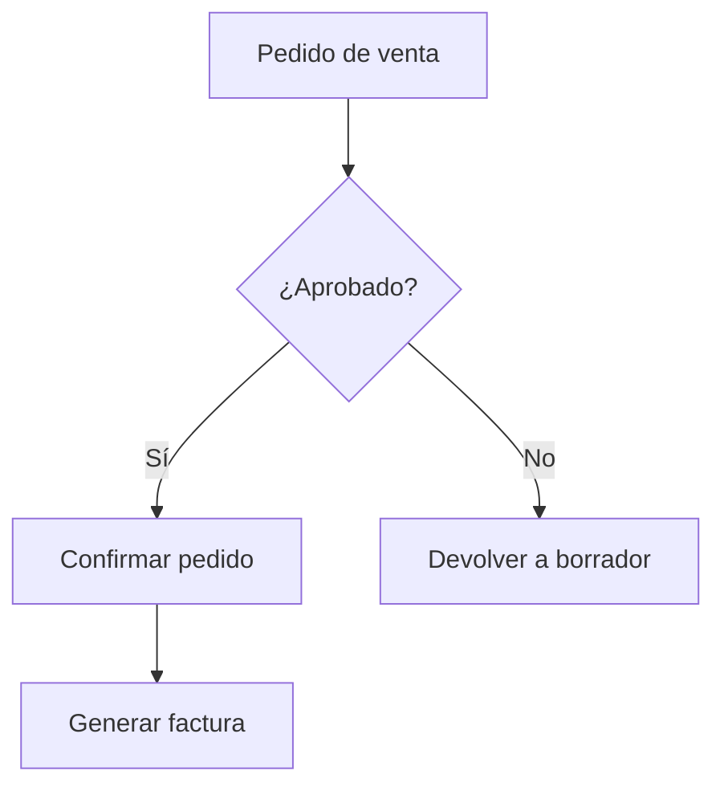

# Documentación del Proyecto

Esta carpeta contiene toda la documentación técnica del proyecto: diagramas de arquitectura, flujos de negocio, decisiones de diseño y referencias externas.

---

## Contenido

```
docs/
├── README.md                   ← este archivo
│
├── architecture/               Diagramas de arquitectura técnica
│   ├── db-schema.drawio        Esquema de base de datos (fuente editable)
│   ├── db-schema.png           Exportación para visualización rápida
│   ├── module-dependencies.md  Dependencias entre módulos (Mermaid)
│   └── system-overview.drawio  Vista general del sistema
│
├── workflows/                  Flujos de procesos de negocio
│   ├── sale-order-flow.drawio
│   └── invoice-approval.drawio
│
├── decisions/                  Architecture Decision Records (ADRs)
│   ├── ADR-001-docker-over-bare.md
│   ├── ADR-002-module-structure.md
│   └── ADR-003-git-flow-strategy.md
│
└── references/                 Documentos externos (specs, manuales)
    └── odoo19-functional-spec.pdf
```

---

## Política de archivos en este directorio

### Qué versionar y en qué formato

| Tipo de documento | Formato a versionar | Notas |
|---|---|---|
| Diagramas propios | `.drawio` (fuente) | El PNG/SVG lo genera CI o se exporta manualmente al modificar |
| Diagramas en texto | `.md` con bloques Mermaid | Difieren limpiamente en Git |
| Decisiones de arquitectura | `.md` (ADR) | Ver plantilla más abajo |
| Especificaciones funcionales propias | `.md` | Nunca Word ni Google Docs enlazados externamente |
| Documentos externos (specs de cliente, manuales) | `.pdf` | Solo si son referencia fija; van en `references/` |

### Lo que **no** debe estar aquí

- Exportaciones PNG/SVG generadas si ya existe el `.drawio` fuente.
- Documentos de Google Docs o Notion enlazados — si el enlace muere, la documentación muere con él. Exportar o resumir lo esencial en Markdown.
- Capturas de pantalla de Odoo que cambian con cada versión menor.
- Archivos de trabajo temporales (`borrador-v2-final-FINAL.docx`).

---

## Flujo de trabajo para documentación

La documentación sigue el mismo flujo de ramas que el código, con una sola flexibilidad.

### Cambios sustanciales (nuevos diagramas, ADRs, cambios de arquitectura)

```bash
# Crear rama desde develop
git checkout develop && git pull origin develop
git checkout -b docs/nombre-descriptivo

# Hacer cambios en docs/
# Abrir Pull Request a develop
# El líder revisa y aprueba
```

### Correcciones menores (typos, actualizar un puerto, corregir un enlace)

El líder técnico puede hacer push directo a `develop` sin PR. Este es el único caso donde se omite el proceso de PR, y aplica **exclusivamente** para cambios en `docs/` que no afecten código.

### CI para documentación

El pipeline de CI corre un job liviano cuando hay cambios en `docs/**`:

- Valida la sintaxis de los bloques Mermaid en archivos `.md`.
- Verifica que los enlaces internos entre documentos no estén rotos.
- Opcionalmente, genera PDF desde Markdown si está configurado.

Este job no bloquea merges de código — corre en paralelo y es informativo.

---

## Cómo crear un diagrama

### Opción A — Mermaid (recomendado para diagramas de flujo y secuencia)

Crear o editar un archivo `.md` con un bloque de código Mermaid. GitHub lo renderiza nativamente.

````markdown

````

### Opción B — draw.io (recomendado para arquitectura y esquemas complejos)

1. Crear o editar el archivo `.drawio` con [draw.io Desktop](https://github.com/jgraph/drawio-desktop/releases) o en [app.diagrams.net](https://app.diagrams.net).
2. Versionar el `.drawio` en Git — es XML y difiere limpiamente.
3. Exportar un PNG de referencia al mismo directorio si el diagrama es de uso frecuente.
4. Hacer commit de ambos archivos en el mismo commit:

```bash
git add docs/architecture/db-schema.drawio docs/architecture/db-schema.png
git commit -m "docs(architecture): actualizar esquema de BD con tabla de pagos"
```

---

## Architecture Decision Records (ADRs)

Los ADRs documentan por qué se tomó una decisión técnica importante. Son especialmente valiosos en proyectos Odoo donde la pregunta _"¿por qué se personalizó esto en lugar de usar el módulo estándar?"_ aparece constantemente.

### Cuándo escribir un ADR

- Se elige una tecnología o herramienta sobre otra.
- Se decide extender un modelo existente de Odoo en lugar de crear uno nuevo (o viceversa).
- Se adopta una convención de código que no es obvia.
- Se descarta una solución que parece razonable para cualquier desarrollador nuevo.

### Plantilla

Crear el archivo como `docs/decisions/ADR-NNN-titulo-corto.md`:

```markdown
# ADR-NNN: Título que describe la decisión

## Estado

`Propuesto` | `Aceptado` | `Obsoleto` | `Reemplazado por ADR-NNN`

## Contexto

Describir el problema o la situación que requirió tomar una decisión.
Qué fuerzas estaban en juego (técnicas, de equipo, de negocio).

## Decisión

La decisión que se tomó, expresada en voz activa.
"Decidimos usar X porque..."

## Alternativas consideradas

- **Opción A:** descripción breve y por qué se descartó.
- **Opción B:** descripción breve y por qué se descartó.

## Consecuencias

Qué se hace más fácil, qué se hace más difícil, qué deuda técnica se acepta.
```

### ADRs existentes

| # | Título | Estado |
|---|---|---|
| [ADR-001](decisions/ADR-001-docker-over-bare.md) | Docker sobre instalación directa para desarrollo local | Aceptado |
| [ADR-002](decisions/ADR-002-module-structure.md) | Estructura de módulos custom por dominio funcional | Aceptado |
| [ADR-003](decisions/ADR-003-git-flow-strategy.md) | Git Flow adaptado para equipo de 7 personas | Aceptado |

_Añadir nuevos ADRs a esta tabla al crearlos._

---

## Guía completa de Git Flow

Para referencia, aquí el flujo de ramas completo del proyecto. La fuente autoritativa del proceso de PR y CI está en el [`README.md` raíz](../README.md) y en [`odoo/README.md`](../odoo/README.md).

### Tipos de ramas

| Tipo | Prefijo | Origen | Destino | Responsable |
|---|---|---|---|---|
| Nueva funcionalidad | `feature/<rol>-` | `develop` | `develop` vía PR | Dev asignado |
| Corrección | `fix/<rol>-` | `develop` | `develop` vía PR | Dev asignado |
| Versión | `release/v*.*.*` | `develop` | `main` + `develop` | Líder |
| Urgente | `hotfix/` | `main` | `main` + `develop` | Líder |
| Documentación | `docs/` | `develop` | `develop` vía PR | Cualquiera |

### Convención de nombres — infijos por rol

| Infijo | Rol |
|---|---|
| `back-` | Desarrolladores back-end |
| `front-` | Desarrolladores front-end |
| `db-` | Especialistas en base de datos |

**Ejemplos:**

```
feature/back-sale-order-margin
feature/front-portal-dark-theme
feature/db-migration-res-partner-v2
fix/back-invoice-tax-rounding
docs/architecture-update-db-schema
```

### Ciclo de sprint (2 semanas)

```
Semana 1                            Semana 2
─────────────────────               ─────────────────────────────────
Planning → Dev activo → PRs         Code freeze → QA → Release → Tag
               │                         │              │
           feature/*               release/*        merge main
           → develop                → develop           + vX.Y.Z
```

---

_Última actualización: 2026-03-17_
